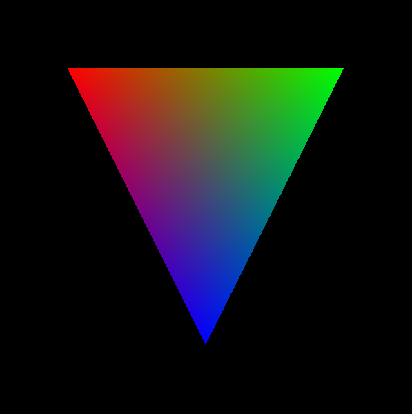

- [About](#about)
- [Usage](#usage)
  - [Construction Options](#construction-options)
  - [Methods](#methods)
  - [Notes](#notes)
- [Examples](#examples)
  - [Triangle](#triangle)
# About 

A helper class for creating meshes in [PixiJS](https://pixijs.com/) with an API
inspired by the mesh class in [OpenFrameworks](https://openframeworks.cc/). 

# Usage
Just copy this class into your project and it will be available for use. Make
sure that your project already has PixiJS. 


## Construction Options
option | type | default 
-|-|-
vertices | Flat array with two components: `[x1,y1,x2,y2,...]` | Empty array: `[]`
indices | Array: `[i1,i2,...]` | Empty array: `[]`
colors | Flat array with three components: `[r1,g1,b1,r2,g2,b2,...]` | Empty Array: `[]`
drawMode | `PIXI.DRAW_MODES` enum. [See here.](https://api.pixijs.io/@pixi/constants/PIXI/DRAW_MODES.html) | `PIXI.DRAW_MODES.TRIANGLES`
vertexShader | Vertex Shader source as `String` | see source
fragmentShader | Fragment Shader source as `String` | see source

## Methods
- `attach(parent)` : attaches the mesh to a parent stage to be rendered. Call
  this once to render the mesh. 
- `addVertex(x,y)` : adds a vertex and updates the geometry. 
- `addVertices([VERTEX_ARRAY])`: adds the vertices and updates the geometry. 
- `updateVertices([VERTEX_ARRAY])`: replaces the current vertices array with a
  new one and updates the geometry.
- `addColor(r,g,b)` : adds a color and updates the geometry. 
- `addColors([COLOR_ARRAY])`: adds the colors and updates the geometry. 
- `updateCors([COLOR_ARRAY])`: replaces the current colors array with a
  new one and updates the geometry.


## Notes
- If there are no vertices or colors (i.e. if any of the two arrays are empty),
  the mesh will not render. 

# Examples 
## Triangle

```js
let app = new PIXI.Application({ width:600,height:600 });
document.body.appendChild(app.view);
let triangle = new PixiMesh({
  vertices: [100,100,500,100,300,500],
  colors: [1.,0.,0.,0.,1.,0.,0.,0.,1.]
})
triangle.attach(app)
```